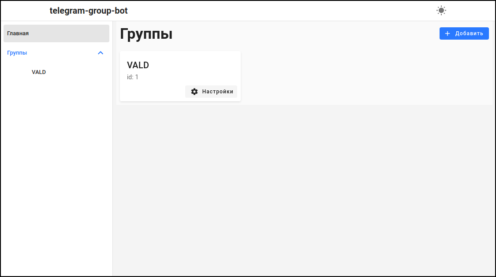
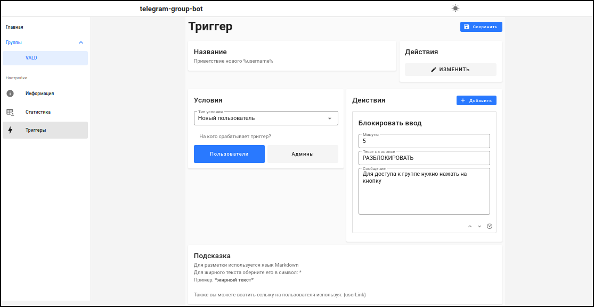
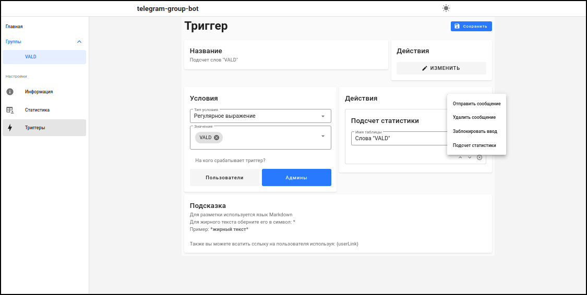

<p align="center">
    
    <h3 align="center">telegram-group-bot</h3>
    <h4 align="center">Бот для модерации групп в Telegram</h4>
</p>

---

## Установка

### Windows

- Скачайте nodejs https://nodejs.org/en/
- Скачайте Visual Studio Community https://visualstudio.microsoft.com/ru/ (в Visual Studio Installer выберите пункт "Разработка классических приложений на C++")
- Скачайте Python https://www.python.org/downloads/
- Установите yarn: `npm install -g yarn`

### Linux

- Установить зависимости: `gcc`, `make`, `nodejs`, `npm`
- Установите yarn: `sudo npm install -g yarn`

### Сборка и запуск

```
cd telegram-group-bot
yarn
yarn run build
yarn run start
```

## Настройка

Пароль для доступа и токен к боту, указаны в файле `.env`\
Пример файла:
```
BOT_TOKEN=
API_TOKEN=VALD_TOKEN
```
## Скриншоты






